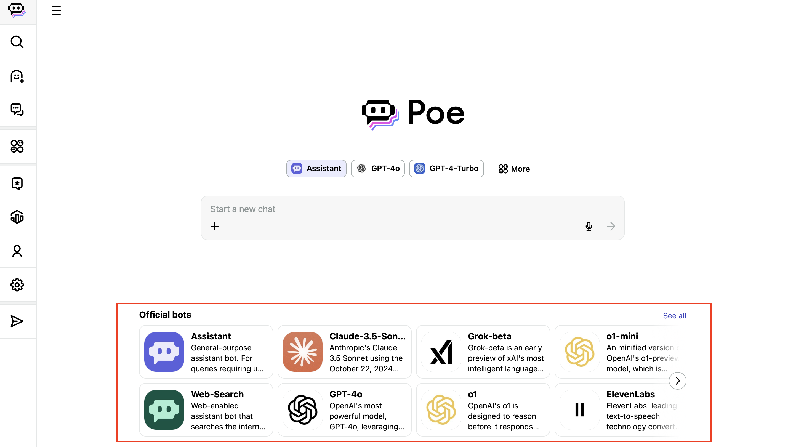
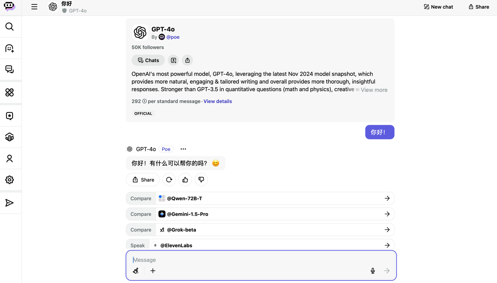

# COIN 新生大语言模型培训指南

## 提示工程

适合没有深度学习和LLM基础的同学，对LLM形成初步认识，并能够直接上手使用。

### 可视化实验平台
推荐使用Poe（https://poe.com）平台进行带有可视化界面的提示工程简单实验，便于零基础同学熟悉LLM使用方式。该平台需要注册，免费版可以使用国内外多种不同来源的LLM，包括Llama系列，Gemini系列，GPT系列，QWen系列等。

1. 登录后，平台首页如下所示，选择红框中提供的官方LLM创建bot：

2. 在下方输入框中输入prompt，LLM给出相应回复（下图中使用模型为gpt-4o，需要订阅，gpt-3.5-turbo支持免费访问）

### 批量API访问实验平台
推荐使用钱多多API平台（https://api2.aigcbest.top）进行可以批量访问的提示工程实验，用于帮助进阶的同学使用相应的LLM api处理大批量数据，便于在研究数据集上实验。注：该网站需要充值，按每次查询大模型的内容量计费，但是相比于大模型的官方API便宜，且不需要翻墙可以使用国外的多个LLM。

各个模型的价目表：https://api2.aigcbest.top/pricing 
如果使用常用的gpt-3.5-turbo模型，一共生成1M token（一百万个单词或汉字）的回复，仅需1.5美元。

### 资料汇总

* 提示工程总结博客： https://www.promptingguide.ai
可以快速了解提示工程的定义与各种类别以及对应论文。

* Search-O1：https://mp.weixin.qq.com/s/gqnGyMM_KYYwDbHyWkIIuw
自主知识检索新框架

* Falcon：https://mp.weixin.qq.com/s/QfNiSWyGThJyw2IEY5Ltvg
大模型推理加速范式

## PyTorch教程：

PyTorch 是一个开源的深度学习框架，由 Meta（原 Facebook）开发并维护。它以动态计算图和灵活易用为特点，广泛应用于学术研究和工业实践。

PyTorch 提供了一整套工具，用于构建和训练神经网络，包括：

- **自动微分**：通过动态计算图自动计算梯度，便于实现复杂模型和调试。
- **灵活性**：支持动态调整网络结构，适合研究和实验。
- **GPU 加速**：轻松利用 GPU 提升计算效率。
- **丰富的生态系统**：包括高层封装库（如 TorchVision、TorchText、TorchAudio 等）和工具（如 Lightning、HuggingFace 等）。

PyTorch是目前最广泛使用的深度学习框架之一。

### 资料汇总
* 官方文档：https://pytorch.org/tutorials/
* 中文文档：https://pytorch123.com
* Pytorch实用教程：https://tingsongyu.github.io/PyTorch-Tutorial-2nd/

## 大语言模型训练框架：

### 先导知识：
* 熟悉Python语言与Pytorch深度学习框架
* 了解神经网络基础，

LLaMA-Factory是一个github开源项目，集成了二十多个llama家族模型的相关代码。这些代码包含pre-training，supervised fine-tuning，Reward Modeling，DPO等LLM中的基本阶段。通过该框架，可以在不深入了解每个模型的底层实现的前提下，快速上手微调模型。使用时与huggingface提供的模型结合使用。具体操作请参考项目首页的README。

https://github.com/hiyouga/LLaMA-Factory

以下README中提供了当前版本的各种训练方式的指令，需要熟悉。
https://github.com/hiyouga/LLaMA-Factory/blob/main/examples/README.md

