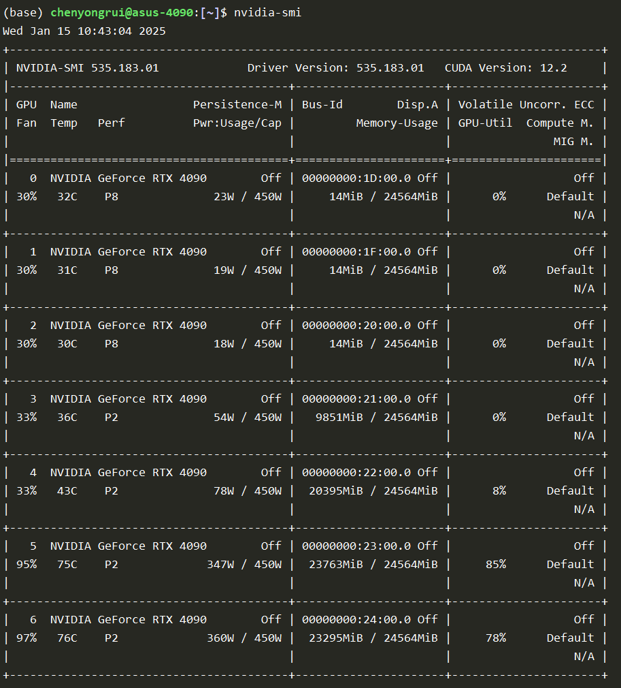
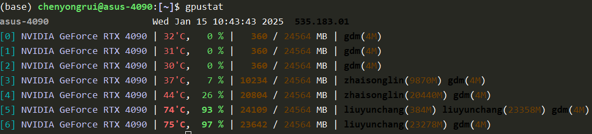
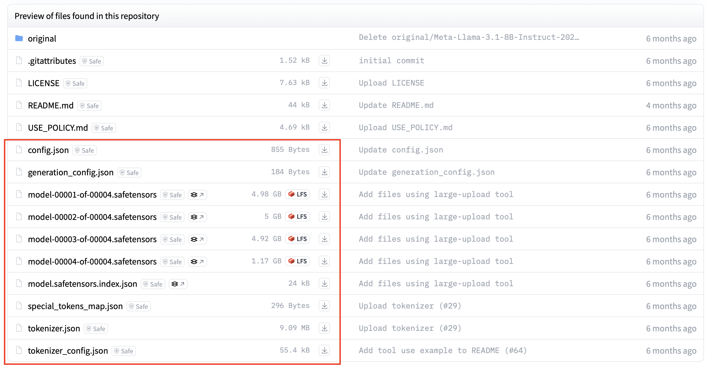

# COIN大语言模型基础学习路线


## 提示工程

### 知识储备要求
* 了解Python编程语言

### 主要学习资料
* [提示工程总结](https://www.promptingguide.ai/zh)
可以快速了解提示工程的定义与各种类别以及对应论文。
主要学习"提示工程简介"与"提示技术"两个章节，其中"提示技术"章节学习到"思维树（TOT）"。
请将学习到的Prompt形式利用以下的实验平台进行实验。
* [《大语言模型》](LLM.pdf) 主要学习第一章与第十章

### 可视化实验平台
推荐使用Poe（https://poe.com）
平台进行带有可视化界面的提示工程简单实验，便于零基础同学熟悉LLM使用方式。该平台需要注册，免费版可以使用国内外多种不同来源的LLM，包括Llama系列，Gemini系列，GPT系列，QWen系列等。

1. 登录后，平台首页如下所示，选择红框中提供的官方LLM创建bot：

2. 在下方输入框中输入prompt，LLM给出相应回复（下图中使用模型为gpt-4o，需要订阅，gpt-3.5-turbo支持免费访问）


### 批量API访问实验平台
* 钱多多API平台（https://api2.aigcbest.top）
进行可以批量访问的提示工程实验，使用相应的公开LLM api处理大批量数据，便于在研究数据集上实验。注：该网站需要充值，按每次查询大模型的内容量计费，但是相比于大模型的官方API便宜，且不需要翻墙可以使用国外的多个LLM。
各个模型的价目表：https://api2.aigcbest.top/pricing 
如果使用常用的gpt-3.5-turbo模型，一共生成1M token（一百万个单词或汉字）的回复，仅需1.5美元。

* deepseek官方API（需要注册申请API Key），快速上手文档：https://api-docs.deepseek.com/zh-cn/

### LLM本地化部署实验

本项目提供了一个基于vLLM的简单大模型推理Python脚本
[llm_inference.py](llm_inference.py)供学习和使用。
基于此脚本，可以在实验室提供的GPU服务器上运行以下指令进行LLM推理实验。
```shell
cd LLM-Training
CUDA_VISIBLE_DEVICES=0 python generate_response.py \
    --prompt_path "path/to/prompts.json" \
    --response_path "path/to/responses.json" \
    --model_path "path/to/model/directory" \
    --temperature 0.7 \
    --top_p 0.9 \
    --max_tokens 2048
```
#### 运行前注意事项：
* 需要将`prompt_path`，`response_path`修改成自己的路径，prompt文件的json格式可以参照[prompt.json](prompt.json)进行处理。
* 需要执行`nvidia-smi`指令查看GPU的显存情况：

或执行`gpustat`指令：

图中展示了7张NVIDIA RTX 4090 GPU，运行7B大小的LLM推理需要当前所用GPU至少有20GB（20000MB）的运行空间。因此，在运行推理前将`CUDA_VISIBLE_DEVICES`设置为空闲的GPU ID（默认是0）。
* LLM检查点需要从[HuggingFace](https://huggingface.co)中下载，保存到本地服务器上，并修改`model_path`路径。以[Llama-3.1-8B-Instruct](https://huggingface.co/meta-llama/Llama-3.1-8B-Instruct/tree/main)为例，需要将下图中红框的文件都下载到本地服务器。

目前，实验室服务器上已经保存了多个常用的LLM检查点，路径为`/datanfs2/chenyongrui/huggingface/`，可供直接使用。


## 其他基础学习资料

* [提示工程学习笔记](https://www.aneasystone.com/archives/2024/01/prompt-engineering-notes.html) 学习到思维树之前
* [Least-to-Most提示可在大型语言模型中实现复杂的推理](https://mp.weixin.qq.com/s/HX0p0nTmtgOsgzNM8rT_SA)
* [MOPO：实现多领域情感文本生成的提示优化](https://mp.weixin.qq.com/s/rYJcReVngtDS-eNvuc0upA)


## 进阶学习资料

* [Transformer原论文](https://arxiv.org/abs/1706.03762)
* [对Transformer的代码注解](https://nlp.seas.harvard.edu/2018/04/03/attention.html)
* [《大语言模型》](LLM.pdf) 学习第五章，第七章与第十一章
* [清华LLM公开课](https://www.bilibili.com/video/BV1UG411p7zv?buvid=XU11F2D1F1B6721741676EA71D3F31356C54F&from_spmid=playlist.playlist-detail.0.0&is_story_h5=false&mid=w7mFjjzdrDXbKb0J8YwY7g%3D%3D&plat_id=116&share_from=ugc&share_medium=android&share_plat=android&share_session_id=00d7fb01-933c-42b3-89c7-7db4d68bd324&share_source=WEIXIN&share_tag=s_i&spmid=united.player-video-detail.0.0&timestamp=1725711243&unique_k=HMZ3qGQ&up_id=493282299&wxfid=o7omF0RtW5yr6BgHzKzhtWiTIqNQ&share_times=2&_unique_id_=8e3bd8bb-c73e-43b4-b8fa-a40e89a44691&code=081C9dll2fDEQe44dlnl2sFU4u1C9dlx&state=&spm_id_from=333.788.videopod.episodes) 主要学习4-1到4-10以及4-16内容。
* [Prompt模版对LLM的影响](https://mp.weixin.qq.com/s/OFwqmnB8Qoq-am-OrRstIQ) 
* [微软开源PromptWizard：自动prompt工具](https://mp.weixin.qq.com/s/_0gERIijVNOlQuhmGv5mOg)
* [RePrompt：提示词自动化优化策略](https://mp.weixin.qq.com/s/R6ZsMZwiHNGcfVowUwPvaQ)
* [自动优化LLM流水线](https://mp.weixin.qq.com/s/oog-dCmWFqT6IAC06pIESA)
* [把ICL和IWL双重学习同时写进提示词](https://mp.weixin.qq.com/s/xkSVSD017xaohG3V-1oRow)
* [知识图谱提示激发大型语言模型中的思维图](https://mp.weixin.qq.com/s/Q9qAHmzMjiWvZg8reTw7dQ)
* [通过结构化数据提升大型语言模型推理能力](https://mp.weixin.qq.com/s/wE60z0HtC2um7Wt5ScG-PQ)


## 一些学习工作中的prompt技巧
当前时代，LLM工具的作用非常强大，使用得当可以显著提升学习工作效率
### 代码编写
进行实验时，对于一些模块化的函数，可以直接使用prompt询问LLM，让其直接为你生成相应的代码。例如：
```text
我需要一个python程序，可以从输入文本中找出所有日期。
```
LLM，如GPT-3.5-turbo，GPT-4o，可以很轻易地直接给出可以运行的正确程序。

### 代码调试
在运行代码时会遭遇各种各样的报错信息，或者环境不完整，此时第一件要做的事，就是可以将报错信息直接输入给LLM，询问他可能的解决办法，例如：
```text
<bug_message>
运行代码时报了这种错误，应该怎么处理？
```
这里`<bug_message>`是复制粘贴来的报错信息。LLM会给你解决方案。如果方案不成功，就把新的错误粘贴上，继续提问。
如果实在解决不了，此时再可以再利用google等搜索引擎进行错误查询。

### 文献阅读
阅读文献，尤其是英文文献，可以使用[豆包app](https://www.doubao.com/chat/?channel=google_sem&source=dbweb_google_sem_pp_hx_pc_01&keywordid=172509644083&gad_source=1&gbraid=0AAAAA-pec8OEqhfApoaJ6AQX3vNtqNfRT&gclid=Cj0KCQiAv628BhC2ARIsAIJIiK96CkiBXONBpQLO-_3_4uwv_1SJrGqZ1o8MFOIeGlEOb50Iwq4eNsAaAkoVEALw_wcB)中的AI阅读功能 或者 [notebooklm](https://notebooklm.google)（需要设置美国节点的VPN），这些工具可以解析PDF文档（论文）进行全文理解。如果文献中有不懂的地方，可以直接提问，让其用中文进行解释。